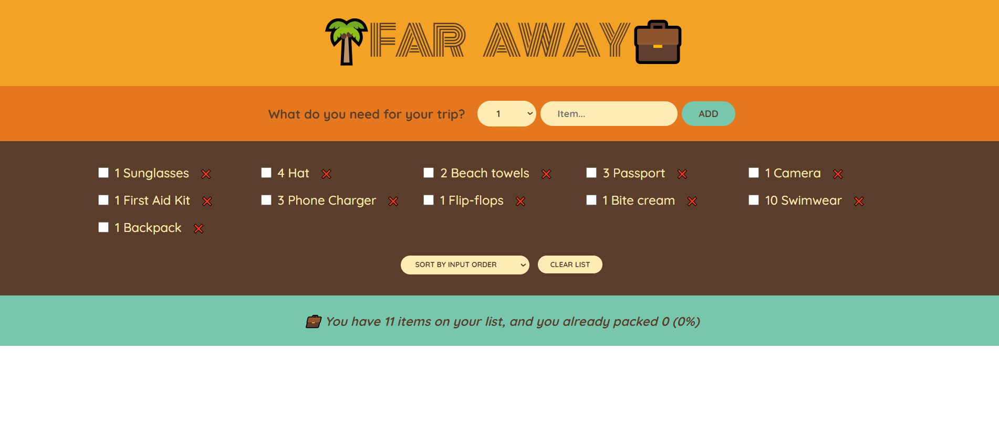
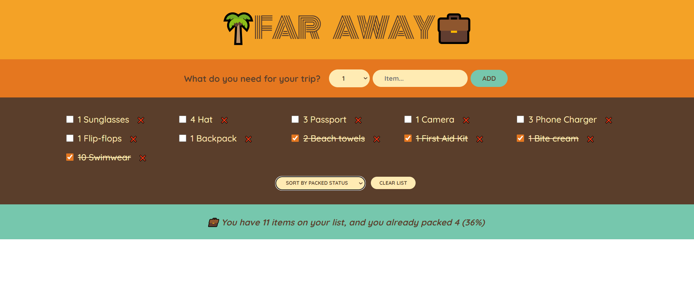
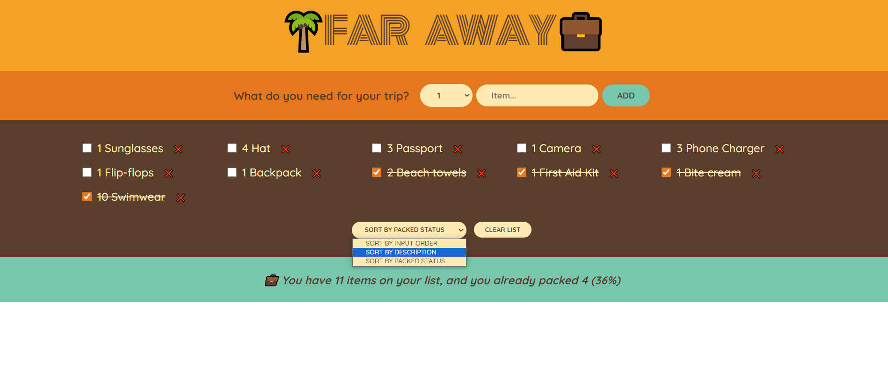

# Far Away

Far Away is a website which is a user can define their needs for holiday. After the user define their needs and its count, It will be shown up the list below. These needs can be checked as packed. Remain work is shown on footer according this ratio. And specified needs can be order by selecting the option in select menu and can be cleaned with clicking the clear list button. I made this website with React.js😉. You can try by clicking <strong>[Far Away](https://far-away-gldn.netlify.app/)</strong>.

 

   
   
 
   
   
 
   
   
 
